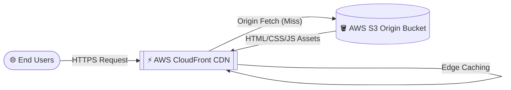

# AWS Cloud Infrastructure Automation: Static Website

[](https://www.terraform.io/)
[](https://aws.amazon.com/s3/)
[](https://aws.amazon.com/cloudfront/)
[](https://en.wikipedia.org/wiki/Infrastructure_as_code)

## 📌 Project Overview
This project demonstrates professional **Infrastructure as Code (IaC)** by automating the deployment of a highly available, globally distributed static web application on Amazon Web Services (AWS). Rather than manually configuring cloud services through the console, this repository uses **Terraform** to programmatically provision a scalable edge infrastructure.

## 🏗️ Cloud Architecture



The architecture consists of:
1. **Amazon S3**: Acts as the robust, highly-available origin storage for the static assets (HTML, CSS, JS).
2. **Amazon CloudFront**: A Global Content Delivery Network (CDN) that caches the S3 assets at Edge Locations worldwide, resulting in single-digit millisecond latency for end users, automated HTTPS/TLS encryption, and DDoS protection.
3. **Terraform**: The HCL scripts in the `terraform/` directory guarantee that the infrastructure is version-controlled, reproducible, and self-documenting.

## 🚀 Deployment Guide

### Prerequisites
- [Terraform](https://developer.hashicorp.com/terraform/downloads) installed locally.
- AWS CLI configured with administrator credentials (`aws configure`).

### Steps
1. **Initialize Terraform**: Downloads the necessary AWS providers.
   ```bash
   cd terraform
   terraform init
   ```
2. **Review the Execution Plan**: Verifies exactly what AWS resources will be created.
   ```bash
   terraform plan
   ```
3. **Provision the Infrastructure**: Deploys the S3 Bucket, Bucket Policies, and CloudFront Distribution.
   ```bash
   terraform apply -auto-approve
   ```
4. **Deploy Application Code**: Sync the local `src/` directory directly to the provisioned S3 Bucket.
   ```bash
   aws s3 sync ../src s3://$(terraform output -raw bucket_name)
   ```
5. **Access the Application**: Navigate to the CloudFront URL outputted by Terraform.
   ```bash
   terraform output cloudfront_url
   ```

## 📸 Deployment Evidence (Legacy Manual Setup)
Before automating via Terraform, this exact architecture was manually validated via the AWS Console to ensure correct CORS, Bucket Policies, and Origin routing. 

<details>
<summary>Click to view AWS Console Proofs</summary>
<br>

**1. S3 Bucket Provisioned in ap-south-1 (Mumbai)**


**2. Website Assets Uploaded to Origin**


**3. Static Website Hosting Configured**


**4. S3 Public Access Bucket Policy applied**


**5. CloudFront Global CDN Distribution Deployed**


</details>

## 👨‍💻 Architect
Engineered by **Lokesh Gounder**  
📧 [lokeshgounder@gmail.com](mailto:lokeshgounder@gmail.com)  
🔗 [GitHub Profile](https://github.com/LOKESH10796)

---
*This repository represents a transition from ClickOps (manual AWS console management) to GitOps/DevOps (Infrastructure as Code) methodologies.*
